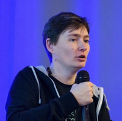

  

    
  

  <h1 class="cover-heading">{{ site.cover.oneliner }}</h1>
  
{{ site.cover.lead }}


  
{{ item }}


  

    <a href="#" class="btn btn-lg btn-secondary">Hire Me</a>
  

  <ul>

    <li>
      <a href="https://linkedin.com/in/{{ site.social.linkedin }}">
        <i class="geek-icon icon ion-social-linkedin"></i>
      </a>
    </li>


    <li>
      <a href="skype:{{ site.social.skype }}?chat">
        <i class="geek-icon icon ion-social-skype"></i>
      </a>
    </li>


    <li>
      <a href="https://www.facebook.com/{{ site.social.facebook }}">
        <i class="geek-icon icon ion-social-facebook"></i>
      </a>
    </li>

  </ul>

